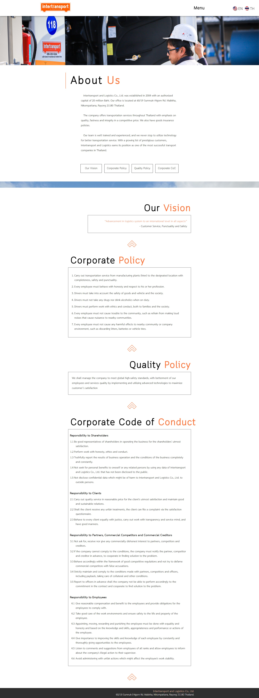

# Intertransport Company Website

A modernized **Intertransport Company Website** built with **React + TypeScript**, converted from a static HTML design into a scalable, component-based architecture.  
This project is used to **present the company’s services, background, and contact information**, providing a professional online presence with responsive design.

---

<p align="center">
    <a href="https://raw.githubusercontent.com/nithasp/intertransport-react-new/master/screenshots/sc1.jpg" target="_blank">
    
  </a>
</p>

---

## Features

- Corporate website to showcase company profile and services.
- Responsive and mobile-friendly design.
- Pages: Home, Intro, About Us, Our Services, Our Clients, Why Us, Contact.
- Reusable components: Navbar, Footer, Map integration, Lightbox Gallery.
- Styled Components for modern, maintainable styling.
- Optimized fonts and images for performance.

---

## Tech Stack

- **React** (with TypeScript)
- **Styled Components**
- **CSS**
- **Custom Components** (Navbar, Footer, LightBoxGallery, Map)

---

## Installation

1. Clone the repository:
   ```bash
   git clone https://github.com/nithasp/intertransport-react-new
   ```

2. Navigate to the project directory:
   ```bash
   cd intertransport-react-new
   ```

3. Install dependencies:
   ```bash
   npm install
   ```

4. Start the development server:
   ```bash
   npm run dev
   ```

5. Open your browser at:
   ```
   http://localhost:3000
   ```
